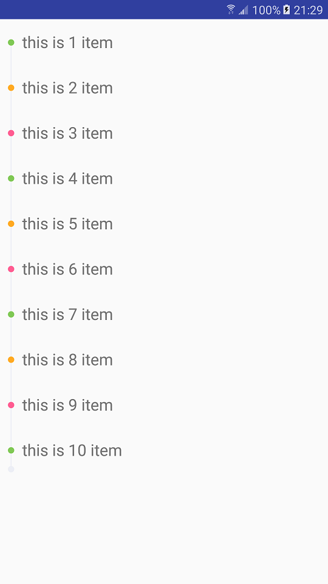

# TimeLineView
基于android的时间轴控件
<br>
## Feature
- 实现了时间轴效果
- 可以自定义属性值
## 用法
###1.首先在xml中定义好
```xml
<cn.appleye.timelineview.TimeLineView
        android:id="@+id/time_line"
        android:layout_width="8dip"
        android:layout_height="match_parent"
        app:lineWidth="1dip"
        app:ballSize="8dip"
        app:ballCenterMargin="25dip"/>
```
###2.下面是所有可以修改的属性
```xml
<?xml version="1.0" encoding="utf-8"?>
<resources>
    <declare-styleable name="timeline_style" >
        <attr name="ball" format="color|reference"/>
        <attr name="line" format="color|reference"/>
        <attr name="ballSize" format="dimension"/>
        <attr name="lineWidth" format="dimension"/>
        <attr name="ballCenterMargin" format="dimension"/>
    </declare-styleable>
</resources>
```
###demo


# About
@Author : Liu Liaopu </br>
@Website : https://github.com/newhope1106

# License
Copyright 2015-2016 Liu Liaopu

Licensed under the Apache License, Version 2.0 (the "License"); you may not use this file except in compliance with the License. You may obtain a copy of the License at

http://www.apache.org/licenses/LICENSE-2.0

Unless required by applicable law or agreed to in writing, software distributed under the License is distributed on an "AS IS" BASIS, WITHOUT WARRANTIES OR CONDITIONS OF ANY KIND, either express or implied. See the License for the specific language governing permissions and limitations under the License.
